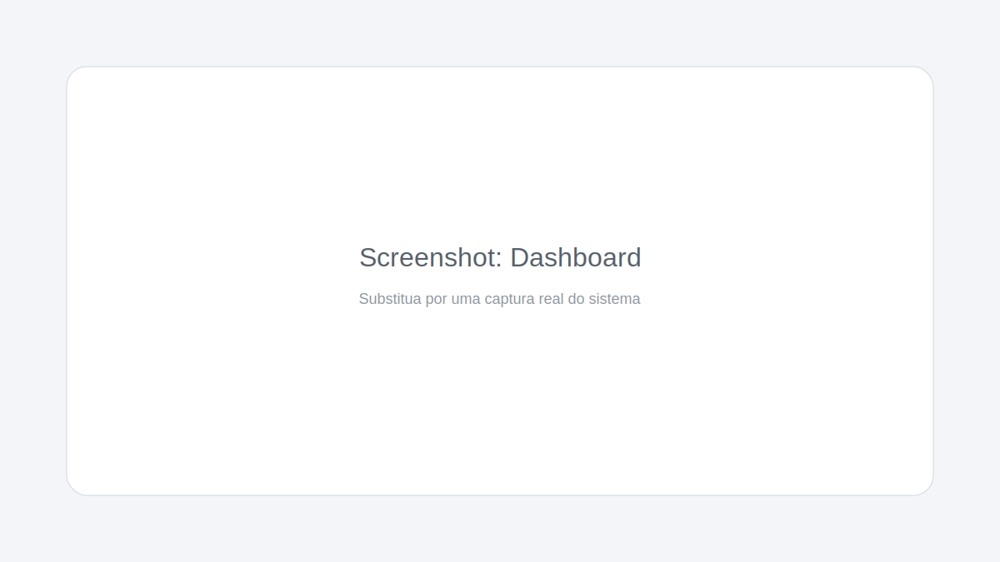
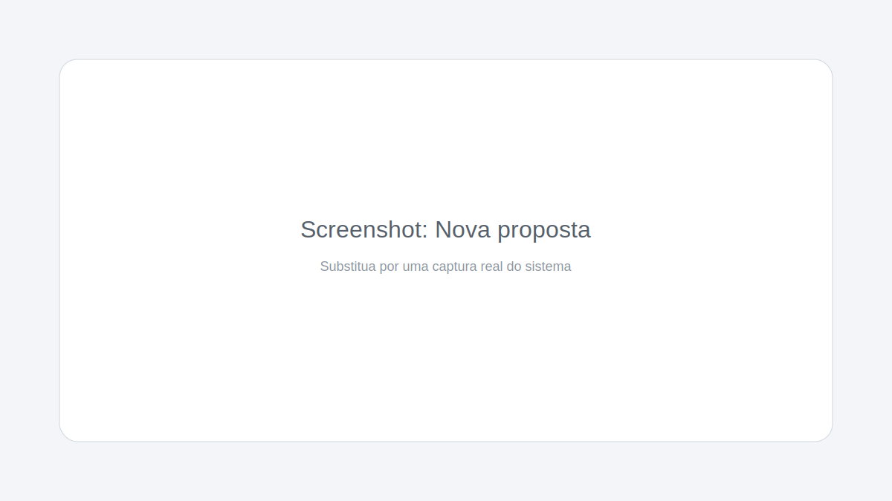

# DealFlow
Sistema moderno de gestão de propostas comerciais.

## Quickstart
```bash
git clone https://github.com/leolima92/DealFlow.git
cd DealFlow
python -m venv venv
# Windows
venv\Scripts\activate
# Linux/Mac
# source venv/bin/activate
pip install -r requirements.txt
python scripts/init_db.py --reset
python app.py
```

## Demo
Em breve! Enquanto isso, veja as telas abaixo.
## Screenshots




## Visão geral
DealFlow permite criar, gerenciar e enviar propostas com geração de PDF/Excel, controle de status e autenticação.

## Funcionalidades
- Cadastro de clientes e propostas
- Templates de proposta (layout, textos e cor no PDF)
- Itens com descrição, quantidade, valor unitário e descontos
- Status: rascunho, enviada, aceita, recusada, cancelada
- Exportação em PDF e Excel
- Autenticação e sessão de usuários
- Tema claro/escuro com preferência salva

## Tecnologias
- Python 3.11+
- Flask
- SQLite
- OpenPyXL
- ReportLab
- Bootstrap 5
- JavaScript

## Requisitos
- Python 3.11+

## Instalação e execução
1. Crie e ative o ambiente virtual
```bash
python -m venv venv
venv\Scripts\activate  # Windows
source venv/bin/activate  # Linux/Mac
```

2. Instale as dependencias
```bash
pip install -r requirements.txt
```

3. Inicie o servidor
```bash
python app.py
```

Acesse `http://localhost:5000`.

## Credenciais de demo
Usuário padrão criado pelo `init_db.py`:
- usuário: `admin`
- senha: `admin`

## Desenvolvimento e testes
```bash
pip install -r requirements-dev.txt
```

```bash
pytest
ruff check .
```

## Configuração
Copie `.env.example` para `.env` e ajuste os valores conforme necessário.

- `DEALFLOW_SECRET_KEY`: chave de sessão do Flask (recomendado definir em produção).
- `DEALFLOW_SECURE_COOKIES`: define cookies de sessão como `Secure` (use `true` em produção com HTTPS).
- `DEALFLOW_SESSION_SAMESITE`: padrão `Lax`.
- `DEALFLOW_LOG_LEVEL`: nivel de log (ex.: `INFO`, `DEBUG`).
- `DEALFLOW_DB_PATH`: caminho do banco SQLite (padrão `instance/dealflow.db`).
- Logs em `logs/app.log` com rotação.
- Base local em `instance/` (ou no caminho configurado em `DEALFLOW_DB_PATH`).
- Logo padrao em `static/img/dealflow_logo.png` (usado nos templates).

## Segurança
- Senhas armazenadas com hash (Argon2).
- CSRF habilitado para todos os formulários (Flask-WTF).
- Cookies de sessão com `HttpOnly` e `SameSite` por padrão.

## Banco de dados (recriacao/seed)
Para recriar o banco e o usuário admin do zero:
```bash
python scripts/init_db.py --reset
```

## Roadmap
- [x] CRUD + status + templates
- [x] Exportação PDF/Excel
- [x] Auth + CSRF + Argon2
- [ ] Link público da proposta (token + expiração)
- [ ] Envio por e-mail (SMTP)
- [ ] Docker + guia de deploy

## Estrutura
```
DealFlow/
  app.py
  gestor_propostas/
    __init__.py
    auth.py
    models.py
    ui.py
    services/
      storage.py
      pdf_report.py
      excel_report.py
  instance/
    dealflow.db
  webapp/templates/
  static/
```
